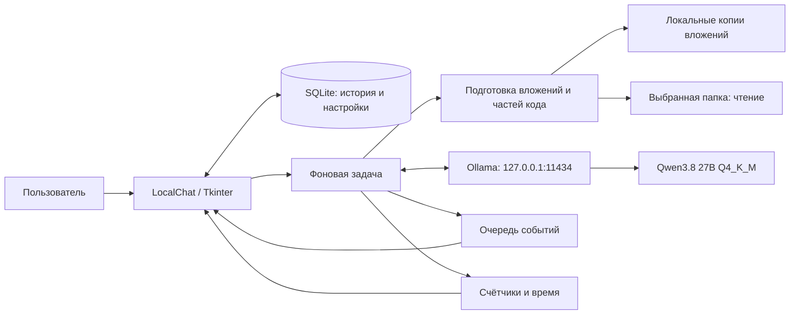

# Архитектура Model Anvi

Model Anvi — одно настольное приложение и локальный HTTP-сервер Ollama.
Python отвечает за интерфейс, подготовку файлов и историю; вывод модели выполняет
Ollama. Веб-интерфейса и отдельного сервера приложения нет.

Этот документ описывает существующий код. Детали вынесены в
[поток вывода](docs/architecture/inference.md) и
[хранение данных](docs/architecture/storage.md).

## Схема компонентов

## Модули

| Модуль | Ответственность |
| --- | --- |
| `local_chat.pyw` | Точка входа, класс `LocalChat`, построение UI, SQLite, запуск Ollama, потоковый HTTP, три сценария вывода, отмена и обработка событий. |
| `attachments.py` | Проверка формата/размера, копирование, извлечение текста, подготовка изображений, подбор фрагментов документа. |
| `local_tools.py` | Описание и выполнение `list_files`, `search_text`, `read_file`; ограничение путей и результатов. |
| `code_analysis.py` | Обход кода, нумерованные части с перекрытием, дополнительное разбиение, перечитывание контекста подозрительной строки. |
| `usage_report.py` | `StreamMeter`, `UsageReport`, форматирование и JSON-сериализация отчёта. |
| `clear_history.pyw` | Проверка выгрузки модели и удаление данных приложения после закрытия. |
| `.cmd` | Установка виртуального окружения, запуск `pythonw`, запуск очистки. |

`local_chat.pyw` пока объединяет несколько обязанностей. Вспомогательные модули
содержат вычисления и файловые операции без зависимостей от главного окна. Новые
операции подготовки данных удобно размещать в этих модулях; управление состоянием
и отображение остаются в `LocalChat`.

## Потоки и состояние

- Главный поток владеет всеми виджетами Tkinter и отображаемой историей.
- Подключение, генерация, анализ и выгрузка модели выполняются в фоновых потоках.
- `queue.Queue` передаёт статусы, токены, ошибки и завершение; `drain_events()`
  опрашивает её каждые 100 мс.
- `ready`, `busy`, `stopping` управляют доступностью действий. Одновременно
  пользователь запускает один ответ/анализ.
- `request_id` и `threading.Event` отделяют текущий запрос от отменённого.
- `response_lock` защищает ссылки на активное соединение/ответ при остановке.
- `stream_parts` накапливает текст; рендерер обычного текста/Markdown обновляет
  виджет пакетами. Markdown поддерживает основные заголовки, списки, выделение,
  ссылки и блоки кода; это собственный ограниченный рендерер.

## Три пользовательских сценария

### Чат и вложения

`send()` валидирует вопрос и выбранные файлы, создаёт чат при необходимости,
копирует вложения, сохраняет пользовательское сообщение и запускает `generate()`.
`prepare_chat_messages()` извлекает текст/изображения, кеширует метаданные и
подбирает фрагменты. Для просьбы о полной сводке длинный документ последовательно
сокращается отдельными запросами. Ответ приходит потоком из `/api/chat`.

### Вопросы о выбранной папке

Обычная отправка вопроса при выбранной папке включает три инструмента чтения.
Модель выбирает файлы, приложение выполняет инструменты и передаёт ограниченные
результаты в следующий запрос. Это выборочное чтение под вопрос пользователя;
оно не обеспечивает полного обхода проекта.

### Анализ файла или папки

Кнопки анализа запускают `run_code_analysis()`: полный сбор допустимых исходников
в пределах лимитов → последовательные JSON-сводки частей → перечитывание
подозрительных строк → повторная проверка → сжатие проверок при необходимости →
итоговый ответ с продолжениями. Проблемы охвата и незавершённый вывод отмечаются
в тексте и статусе. Модель предлагает изменения; исходные файлы не записываются.

## Ollama и жизненный цикл

`ensure_server()` сначала проверяет `/api/version`. Доступный сервер используется
как есть. Если сервера нет, приложение запускает `../Ollama/ollama.exe serve`
с каталогом моделей `../models/` и ожидает ответа до 10 секунд.

Для своего процесса задаются `OLLAMA_HOST=127.0.0.1:11434`, `OLLAMA_NO_CLOUD=1`,
`OLLAMA_NUM_PARALLEL=1`, Flash Attention и KV-кеш `q8_0`. Уже запущенный сервер
не получает эти настройки автоматически.

`stop_model()` отменяет вывод и сохраняет доступный частичный ответ.
`unload_model()` закрывает активный HTTP-поток, ждёт поток генерации, запрашивает
`keep_alive=0` и проверяет `/api/ps`. Закрытие приложения завершает только процесс
Ollama, запущенный им самим; внешний сервер остаётся под управлением пользователя.

## Границы данных

HTTP-запросы приложения идут на loopback. Код выбранной папки читается без записи
и без выполнения команд. Вложения копируются в каталог приложения, чтобы вопрос
по тому же файлу работал после переноса оригинала. SQLite и копии файлов не
зашифрованы; доступ к ним определяется правами Windows.

Лимиты находятся рядом с реализацией: `REASONING_PRESETS` и бюджеты в
`local_chat.pyw`, форматы/размеры в `attachments.py`, охват исходников в
`code_analysis.py`, ограничения инструментов в `local_tools.py`.

## Проверка архитектурных свойств

`test_analysis.py` проверяет продолжения, переполнение контекста, повторные
запросы, охват строк/кандидатов и доступность остановки.
`test_attachments.py` проверяет форматы, кеширование, копии, полезную нагрузку
изображений, очистку и создание элементов UI.
`test_usage_report.py` проверяет точные суммарные счётчики, неполные запросы и
добавление таблицы отчётов к существующей базе.

Тесты работают с подменённым выводом и временными данными. Они проверяют
оркестрацию и обработку файлов, а не качество ответов Qwen или скорость GPU.
