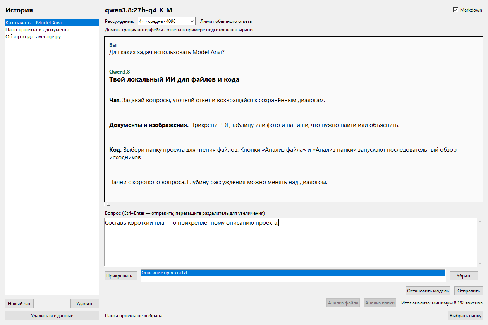
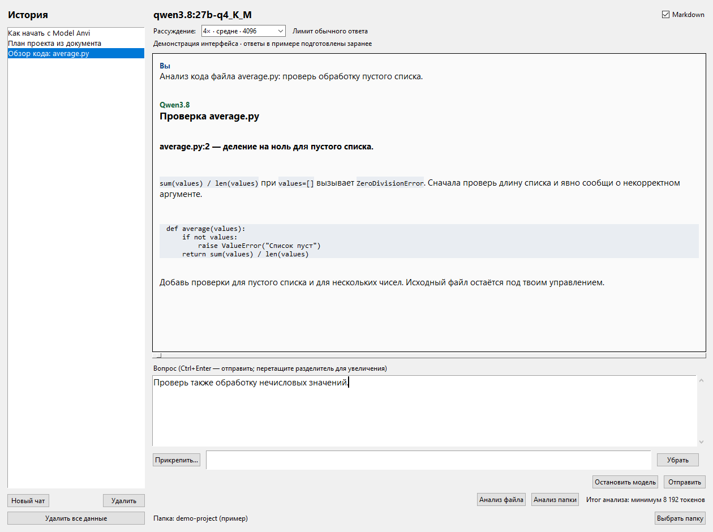

# Model Anvi — Local AI Workspace

**Твой локальный ИИ для чата, документов и кода.**

Local AI desktop workspace powered by Ollama: private chat, document & image Q&A,
code review, reasoning controls, and token timing. Windows · Python · Tkinter.

Model Anvi — настольное приложение, в котором можно обсудить идею,
задать вопрос по файлу и разобрать код проекта. Модель работает через локальную
Ollama, диалоги сохраняются на компьютере. После загрузки модели и зависимостей
для локального вывода не нужны аккаунт, API-ключ или подключение к интернету.



*Реальный интерфейс приложения с демонстрационной историей. Ответы на снимках
подготовлены заранее; это примеры использования, а не результаты тестирования модели.*

## Что умеет приложение

| Возможность | Как это помогает |
| --- | --- |
| Потоковый чат | Ответ появляется по мере генерации; диалоги остаются в истории. |
| Документы | Вопросы по PDF, Word, Excel, PowerPoint и текстовым файлам. |
| Изображения | Вопросы по фото, скриншотам и сканированным страницам PDF. |
| Работа с проектом | Модель ищет текст и читает файлы выбранной папки. |
| Анализ кода | Последовательный обзор файла или папки с повторной проверкой подозрительных строк. |
| Глубина рассуждения | Семь режимов с разными бюджетами контекста и генерации. |
| Отчёт под ответом | Время по этапам, входные/выходные токены и оценки фаз потока. |
| Markdown и управление памятью | Форматирование ответа и кнопка остановки с выгрузкой модели. |

## Быстрый старт на Windows

### 1. Установи Python и Ollama

Нужны Windows 10 22H2 или новее, **Python 3.10+ с Tcl/Tk** и Ollama.
Локальная проверка выполнена на Python 3.10.11. Скачай
[Python для Windows](https://www.python.org/downloads/windows/) и
[Ollama для Windows](https://ollama.com/download/windows).
При установке Python включи добавление в `PATH`.

После установки Ollama запусти в PowerShell:

```powershell
ollama pull qwen3.8:27b-q4_K_M
ollama list
```

Текущая модель — [Qwen3.8 27B Q4_K_M](https://ollama.com/library/qwen3.8:27b-q4_K_M),
около 18 ГБ на диске. Нужна дополнительная память для вывода и контекста;
скорость зависит от RAM, VRAM и оборудования. Большая глубина рассуждения
увеличивает расход памяти и время ожидания.

### 2. Скачай проект

Клонируй [almuleev/Model-Anvi](https://github.com/almuleev/Model-Anvi)
через GitHub Desktop или Git:

```powershell
git clone https://github.com/almuleev/Model-Anvi.git
cd Model-Anvi
```

Репозиторий приватный: для скачивания нужен доступ к нему.

### 3. Установи зависимости и открой чат

1. Запусти **`Установить зависимости.cmd`**. Скрипт найдёт Python через `py`
   или `PATH`, создаст `.venv` и установит библиотеки для вложений.
2. Запусти **`Запустить чат.cmd`**.
3. Дождись статуса **«Подключено»**, напиши вопрос и нажми **«Отправить»**
   или **Ctrl+Enter**. Первая генерация включает загрузку модели в память.

Приложение использует Ollama на `127.0.0.1:11434`. Если сервер уже работает,
его не нужно запускать повторно. Для отдельной установки рядом с папкой `Chat`
смотри [подробную инструкцию](docs/SETUP.md).

## Три сценария работы

### Задать вопрос по документу или изображению

Нажми **«Прикрепить…»**, выбери до пяти файлов и напиши вопрос, например:
«Выдели сроки и ответственных из этого документа». Файл можно убрать до
отправки. Если отправить вложение без вопроса, приложение попросит модель
описать его содержимое.

Копии файлов сохраняются в папке `attachments`. Следующий вопрос в том же
чате может использовать уже отправленный файл, даже если оригинал перемещён.
Если в переписке несколько наборов вложений, укажи имя нужного файла в вопросе.
Для длинного текста подбираются относящиеся к вопросу фрагменты; просьба о полной
сводке запускает последовательное сокращение документа.

### Разобраться в проекте

Нажми **«Выбрать папку»** и спроси, например: «Где в проекте обрабатываются
ошибки подключения?» Модель сможет перечислить файлы, найти текст и прочитать
нужные строки. При обычном вопросе она выбирает, что читать.

### Проверить код файла или папки

Выбери папку проекта, напиши, что нужно проверить, и нажми **«Анализ файла»**
или **«Анализ папки»**. Приложение разбивает исходники на части, последовательно
просматривает их и повторно проверяет подозрительные строки. В ответе могут
быть пути, номера строк и предложения исправлений. Исходники остаются под твоим
управлением — инструменты модели работают только для чтения.



*Демонстрационный сценарий: обработка пустого списка в `average.py`.*

## Модели и направление развития

Название Model Anvi подходит для разных локальных моделей. Сейчас приложение
настроено на **один тег** `qwen3.8:27b-q4_K_M`; переключателя и загрузчика моделей
в интерфейсе пока нет. Ollama может хранить несколько моделей, но наличие
другой модели само по себе не переключает чат.

Для ручной адаптации измени `MODEL` **в обоих файлах**: `local_chat.pyw`
и `clear_history.pyw`. Возможности изображений, вызовов инструментов и режимы
рассуждения зависят от модели. Пресеты текущей версии настроены для Qwen3.8;
совместимость другого тега требует проверки.

Следующий шаг развития — выбор установленной модели, проверка её возможностей
и отдельные настройки контекста/рассуждения. Подробнее в [плане развития](docs/ROADMAP.md).

## Рассуждение, остановка и отчёты

В списке **«Рассуждение»** есть режим без рассуждения и режимы от 2× до 20×.
Это бюджеты генерации, а не коэффициенты качества или скорости. Лимит включает
также рассуждение; видимый ответ может быть короче. Для итогов анализа кода
действуют отдельные бюджеты, показанные рядом с кнопками анализа.

**«Остановить модель»** прерывает ответ, сохраняет доступный текст с отметкой
остановки и пытается выгрузить модель из RAM/VRAM. Дождись сообщения
**«Модель остановлена · память освобождена»**.

Под ответом сохраняется отчёт о времени и токенах. Суммарные токены берутся
из счётчиков Ollama; распределение по рассуждению/ответу с `≈` — оценка.
Для прерванного запроса отчёт отмечает недостающие счётчики.

## Форматы и ограничения

| Что обрабатывается | Форматы и лимиты |
| --- | --- |
| Изображения | JPG, JPEG, PNG, WebP, BMP, TIFF; подготовка JPEG с длинной стороной до 1 600 px. |
| Текст | TXT, MD, CSV, JSON, PY, LOG. |
| Документы | PDF, DOCX, XLSX, PPTX; Excel передаёт значения/текст формул без пересчёта. |
| Вложения | До 5 файлов по 25 МБ каждый; до 5 изображений в запросе, включая страницы/картинки документов. |
| PDF | До 100 страниц, из них до 12 без текстового слоя; распознавание сканов выполняет модель. |
| Извлечённый текст | До 300 000 символов на документ; сокращение и неполный охват отмечаются. |
| Анализ исходников | До 200 файлов и 10 000 строк суммарно, до 2 МБ на файл. |

Полный обход исходников в установленном лимите не гарантирует нахождение всех
ошибок. Проверяй вывод по указанным строкам и учитывай сообщения о неполном охвате.

## Где хранятся данные

Переписки, настройки и отчёты находятся в `history.sqlite3` рядом с приложением.
Копии вложений — в `attachments/`. Эти файлы хранятся без шифрования и
исключены из Git вместе с окружением, журналами и весами моделей.

**«Удалить»** удаляет выбранный чат и его копии вложений.
**«Удалить все данные»** после подтверждения закрывает приложение и удаляет
историю, настройки, копии вложений и локальный журнал. Оригиналы файлов
и скачанные модели сохраняются.

## Документация и разработка

| Документ | Что внутри |
| --- | --- |
| [Установка и устранение проблем](docs/SETUP.md) | Запуск из PowerShell, стандартная и отдельная Ollama, типичные ошибки. |
| [Архитектура](ARCHITECTURE.md) | Карта модулей, потоки, жизненный цикл приложения. |
| [Запросы и контекст](docs/architecture/inference.md) | Сценарии генерации, лимиты, отмена и метрики. |
| [Хранение данных](docs/architecture/storage.md) | SQLite, вложения и очистка. |
| [Инструкции для агентов](AGENTS.md) | Правила работы с кодом, данными и Git. |
| [Вклад в проект](CONTRIBUTING.md) | Окружение, тесты и проверка изменений. |
| [План развития](docs/ROADMAP.md) | Поддержка разных моделей и последующие задачи. |

Быстрая проверка из корня репозитория:

```powershell
.\.venv\Scripts\python.exe -m unittest discover -v -p "test_*.py"
```

Тесты используют временные данные и подменённые ответы; Ollama и GPU им не нужны.
Та же команда запускается в GitHub Actions на Windows.
