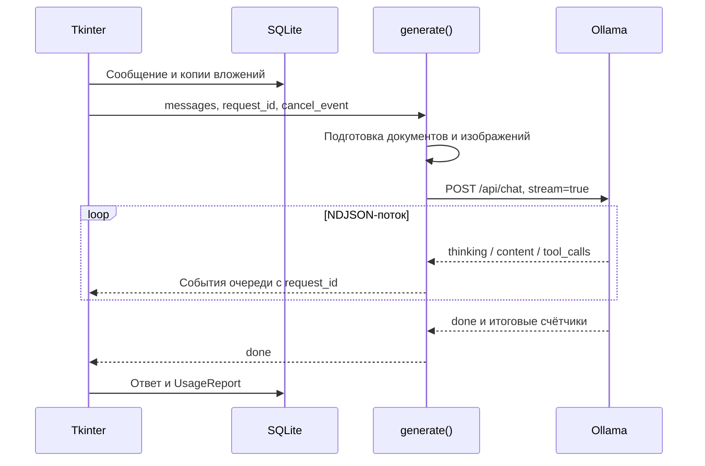

# Запросы, контекст и отмена

[Обзор архитектуры](../../ARCHITECTURE.md) · [Хранение](storage.md)

## Обычный запрос

Поток состоит из JSON-объектов, по одному на строку. Поле `thinking` влияет
на статус и метрики; основной текст ответа берётся из `message.content`.
Ошибка HTTP, событие `error`, отсутствие `done` и завершение по лимиту токенов
обрабатываются отдельно.

## Бюджеты обычного чата

`REASONING_PRESETS` задаёт значение `think`, `num_predict` и `num_ctx`:

| Ключ | Рассуждение | Лимит генерации | Контекст |
| --- | --- | ---: | ---: |
| `off` | Выключено | 1 024 | 4 096 |
| `2x` | `medium` | 2 048 | 8 192 |
| `4x` | `medium` | 4 096 | 12 288 |
| `deep` | `xhigh` | 4 096 | 12 288 |
| `8x` | `xhigh` | 8 192 | 16 384 |
| `10x` | `xhigh` | 10 240 | 20 480 |
| `20x` | `xhigh` | 20 480 | 32 768 |

Лимит генерации расходуется также на рассуждение модели и не гарантирует
такую длину видимого ответа. Наличие изображений увеличивает `num_ctx`
как минимум до 16 384. Эти бюджеты являются настройками приложения,
а не максимальным контекстом самой модели.

`recent_messages()` берёт не более десяти последних сообщений и укладывает
их в символьный бюджет: 12 000 для обычного чата, 2 500 при выбранной папке.
Вся сохранённая история не передаётся в каждый запрос. Эти значения считаются
в символах и не эквивалентны числу токенов.

Текст документа извлекается до 300 000 символов. Для вопроса выбираются
фрагменты по совпадению слов; это простой лексический отбор, без эмбеддингов
и векторной базы. Для полной сводки используется последовательное сокращение.
В один запрос включается до пяти изображений; пропуски отображаются в примечаниях.

## Инструменты папки

При выбранной папке в `/api/chat` передаются описания трёх функций из
`local_tools.TOOLS`. Инструменты исполняет Python, затем добавляет результаты
с ролью `tool` в следующий запрос. Цикл допускает до шести раундов;
последний запрос просит итог без новых вызовов.

| Ограничение | Значение |
| --- | ---: |
| Обход файлов инструментами | 2 000 файлов |
| Размер читаемого/обыскиваемого файла | 1 000 000 байт |
| Результат одного инструмента | До 1 800 символов |
| `list_files` | До 100 путей |
| `search_text` | До 30 совпадений |
| `read_file` | До 100 строк, до 400 символов в строке |

Пути проходят `resolve_inside()`. Обход пропускает ссылки и служебные
каталоги из `SKIP_DIRS`. Результаты последних раундов ограничены, чтобы
не вытеснять исходный вопрос из контекста.

## Полный анализ исходников

1. Сбор: до 200 файлов, 10 000 строк суммарно, 2 000 000 байт на файл.
   Слишком большая папка отклоняется с предложением выбрать меньшую область.
2. Разбиение: до 250 нумерованных записей/9 000 символов на часть,
   перекрытие восемь записей. Длинные строки тоже сегментируются.
3. Первый проход: JSON с ролью фрагмента и максимум тремя подозрениями.
   Контекст 8 192; генерация 900, затем 3 072 при неполном JSON.
4. Повторная проверка: кандидаты дедуплицируются по пути/строке,
   перечитываются с окружением и проверяются группами до четырёх.
5. Сжатие: длинные результаты проверок сокращаются с сохранением путей,
   номеров строк и различия между подтверждением и гипотезой.
6. Итог: фиксированный контекст до 16 384, ограниченная сводка,
   ответ порциями до 3 072 токенов плюс резерв рассуждения. Продолжения
   используют хвост ответа, а не накапливают весь предыдущий вывод в контексте.

Ошибки контекста приводят к дополнительному разбиению или уменьшению сводки.
Для некоторых временных ошибок есть повторный запрос. Непроверенные части,
сокращённые сведения и исчерпанные продолжения отмечаются явно.
«Полный» относится к обходу строк в установленном лимите, а не к гарантии
нахождения всех ошибок или сохранению каждой детали в финальной сводке.

## Остановка

`stop_model()` выставляет `cancel_event`, увеличивает `request_id` и сохраняет
уже видимый ответ с отметкой остановки. Старые события игнорируются.
`unload_model()` закрывает сокет/ответ, ждёт поток и выполняет запрос
`/api/generate` с `keep_alive=0`. Только после проверки `/api/ps` и состояния
потока интерфейс сообщает, что модель остановлена. При неудаче выводится ошибка.

## Метрики

`UsageReport` собирает время приложения по этапам: чат, подготовка вложений,
подготовка кода, чтение файлов, первичный анализ, повторная проверка,
сжатие сводок и итог. Подготовка и сокращение документов учитываются в этапе
вложений. Названия определены в `STAGE_NAMES`.

Точные входные/выходные токены и длительности загрузки, обработки промпта
и генерации приходят из финального события Ollama. `StreamMeter` измеряет
переходы фаз потока; токены по отдельным фазам оцениваются по доле символов.
Знак `≈` обозначает оценку. Для запроса без финального события отмечаются
недостающие счётчики; полный итог не выдумывается.
