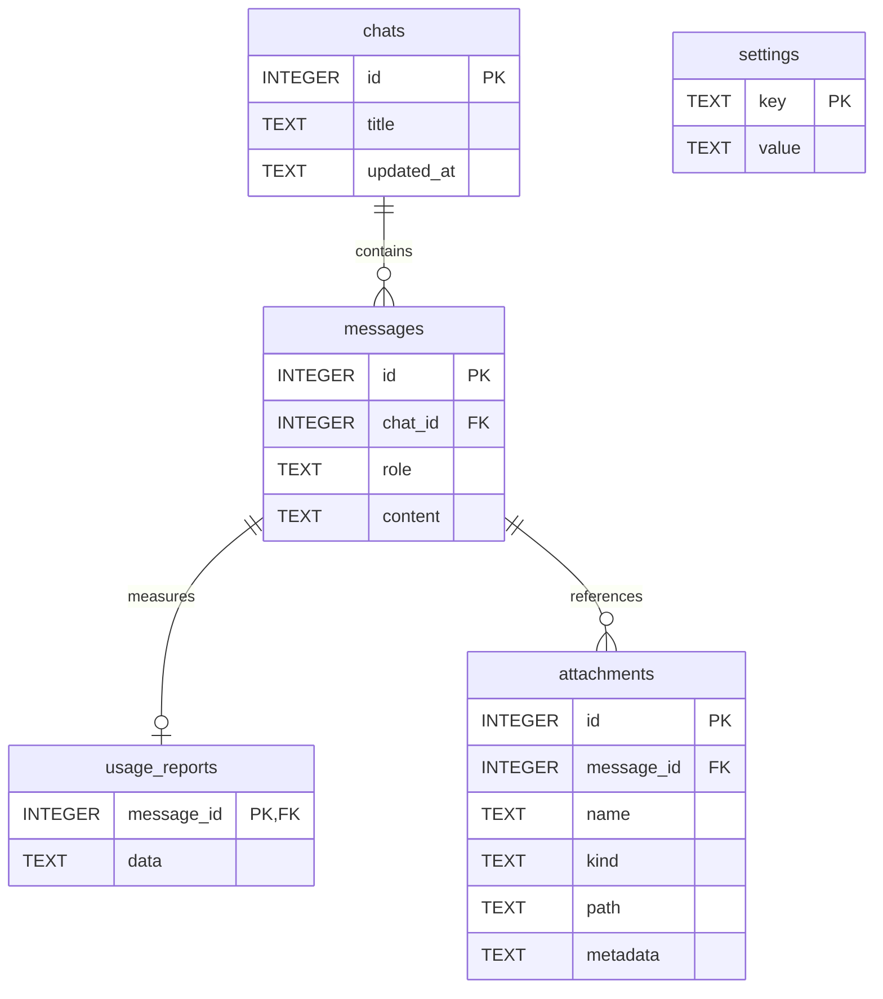

# Хранение и жизненный цикл данных

[Обзор архитектуры](../../ARCHITECTURE.md) · [Поток вывода](inference.md)

## Каталоги

Все пути вычисляются от `Path(__file__).resolve().parent` в `local_chat.pyw`.

```text
каталог приложения/       # Git-корень; в локальной установке называется Chat
├── history.sqlite3      # переписки, настройки, метаданные вложений, отчёты
├── attachments/
│   └── <chat_id>/        # копии с UUID, подготовленные JPEG, извлечённый текст
├── server.log           # только если приложение само запустило Ollama
└── .venv/               # библиотеки Python
```

`../Ollama/` и `../models/` используются для отдельного запуска Ollama, если
готовый сервер на порту 11434 не найден. Эти каталоги и данные исполнения
исключены из Git. У стандартно установленной Ollama свой каталог моделей.

## SQLite

`init_db()` создаёт таблицы через `CREATE TABLE IF NOT EXISTS`.
`db_connect()` включает `PRAGMA foreign_keys=ON` и `PRAGMA secure_delete=ON`.
Рабочие соединения короткие и создаются для конкретной операции.



| Таблица | Содержимое |
| --- | --- |
| `chats` | Название из начала первого вопроса и время последнего сообщения. |
| `messages` | Последовательность ролей `user`/`assistant` и текст; порядок по `id`. |
| `usage_reports` | JSON отчёта для ответа; максимум одна строка на сообщение. |
| `attachments` | Исходное отображаемое имя, вид, относительный путь копии и JSON-кеш обработки. |
| `settings` | `markdown_enabled`, `reasoning_preset`, `workspace`, `composer_height`. |

Все внешние ключи используют `ON DELETE CASCADE`. Пути вложений записаны
относительно `ATTACHMENTS_DIR`; выбранная папка проекта хранится в настройках.
История и локальные файлы хранятся открытым текстом.

## Вложение: от оригинала до ответа

1. `validate_sources()` проверяет число файлов, тип и размер.
2. `copy_sources()` создаёт `<chat_id>/` и копирует каждый файл под именем UUID.
   Пользовательское имя хранится отдельно.
3. При подготовке запроса `process_attachment()` читает локальную копию,
   записывает извлечённый текст и готовит JPEG для модели.
4. `prepare_chat_messages()` сохраняет метаданные, затем использует их для
   следующих вопросов. Изменённый или перемещённый оригинал не заменяет копию.
5. `stored_path()` разрешает относительный путь и проверяет, что результат
   остаётся внутри хранилища и является существующим файлом.

## Удаление

| Действие | Поведение |
| --- | --- |
| «Убрать» до отправки | Убирает файл из списка будущих вложений. Оригинал сохраняется. |
| «Удалить» для выбранного чата | После подтверждения удаляет чат и связанные строки, выполняет `VACUUM`, удаляет папку копий этого чата. |
| «Удалить все данные» | После подтверждения запускает отдельный процесс очистки и закрывает приложение. |
| `Удалить всю историю.cmd` | Запускает ту же очистку с отдельным подтверждением; окно чата должно быть закрыто. |

`clear_history.pyw` сначала пытается выгрузить модель. Затем очищает сообщения,
чаты и настройки в SQLite, проверяет результат, удаляет БД и её служебные файлы,
`server.log`, каталог копий вложений и старые `markdown-test-*.sqlite3`.
При проблеме выгрузки памяти очистка файлов может быть выполнена с отдельным
сообщением о состоянии модели. Модели, исходный код и оригиналы вложений
не относятся к данным, удаляемым этим сценарием.

`secure_delete` и `VACUUM` относятся к содержимому SQLite. Они не гарантируют
уничтожение копий в резервном хранилище или физическое стирание блоков SSD.

## Изменение схемы

Система версионных миграций пока отсутствует. Добавление новой таблицы через
`IF NOT EXISTS` совместимо с текущим стартом. При изменении колонок нужна явная
миграция с проверкой существующей базы. Проверяйте сохранность сообщений,
вложений и каскадное удаление на временной копии, а не на истории пользователя.
